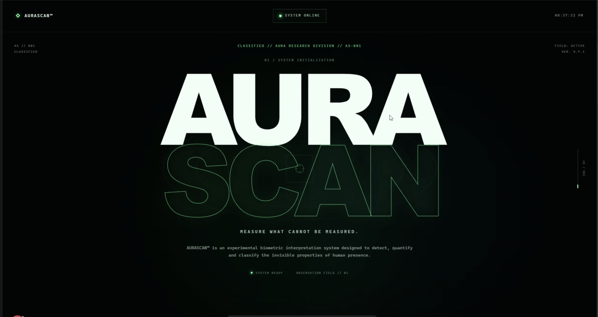
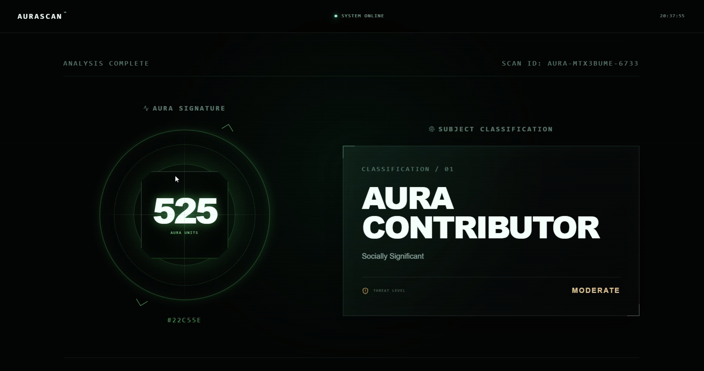
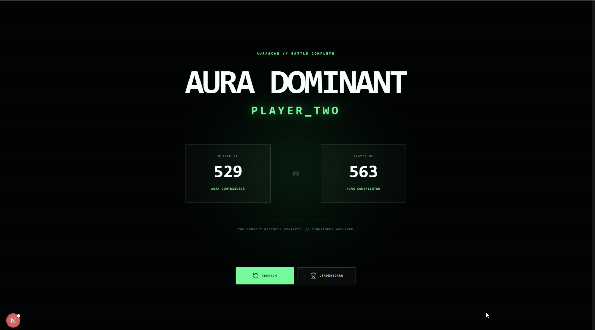

# AURASCAN™️ — Measure What Cannot Be Measured 🎯

## Basic Details
### Team Name: Triple T

### Team Members
- Team Lead: PRAYAG MANAS - ALBERTIAN INSTITUTE OF SCIENCE AND TECHNOLOGY (AISAT)
- Member 2: JOHN KURUVILLA CHAKIAT - ALBERTIAN INSTITUTE OF SCIENCE AND TECHNOLOGY (AISAT)

### Project Description
AURASCAN™️ is a fictional scientific aura-analysis system that uses a webcam to detect human presence and generate a completely
questionable Aura Score between 0–1000 AU. It measures highly suspicious parameters such as Main Character Energy, Social Gravity, Vibe
Density, Confidence Flux, NPC Resistance andCosmic Alignment.

### The Problem (that doesn't exist)
Humanity has no scientifically accepted method for determining who has more aura.

This creates serious problems:

- Arguments over who is the main character
- Unresolved aura differences
- People claiming to be "built different" without evidence
- No standardized unit for measuring vibes

Someone had to solve this.

### The Solution (that nobody asked for)
AURASCAN™️ takes something completely impossible to measure — your aura — and turns it into extremely precise-looking scientific data.
Point a webcam at yourself. AURASCAN™️ detects your face, analyzes highly questionable "biometric" signals, runs some definitely-not-peer-reviewed mathematics, and produces your official Aura Score™ from 0–1000 AU.

Then things get serious.

Enter AURA BATTLE, where two people stand in front of the same camera and discover, once and for all, who has more aura.

No arguments.
No opinions.
Just completely fabricated scientific evidence.

The science is questionable.
The numbers are suspiciously precise.
The results are final.

## Technical Details
### Technologies/Components Used
For Software:
- **Language:** TypeScript
- **Framework:** Next.js
- **Styling:** Tailwind CSS
- **Animation:** Framer Motion
- **UI Icons:** Lucide React
- **Computer Vision:** MediaPipe Tasks Vision
- **Camera API:** Browser MediaDevices / getUserMedia
- **Storage:** Browser localStorage / sessionStorage
- **Deployment:** Vercel
- **Version Control:** Git + GitHub

### Implementation
For Software:
### Aura Scanning

The webcam provides a live video feed to the browser.

MediaPipe detects the subject's face while the system collects intentionally questionable measurements such as:

- Face stability
- Movement
- Brightness
- Main Character Energy
- Social Gravity
- Vibe Density
- Confidence Flux
- NPC Resistance
- Cosmic Alignment

These values are passed through the AURASCAN scoring engine to generate a final Aura Score from **0–1000 AU**.

### Aura Classification

Subjects are classified according to their Aura Score:

| Score | Classification |
|---:|---|
| 0–99 | AURALESS |
| 100–199 | BACKGROUND CHARACTER |
| 200–299 | NPC |
| 300–449 | REGULAR HUMAN |
| 450–599 | AURA CONTRIBUTOR |
| 600–749 | MAIN CHARACTER |
| 750–849 | AURA OVERLORD |
| 850–949 | COSMIC ENTITY |
| 950–1000 | ILLEGAL AURA |

### AURA BATTLE

Two people stand in front of a **single webcam**.

The system:

1. Detects the number of faces.
2. Waits until exactly two subjects are present.
3. Assigns the left subject as Player 1.
4. Assigns the right subject as Player 2.
5. Tracks both subjects during the scan.
6. Generates an Aura Score for each player.
7. Compares their scores.
8. Declares the winner.

Possible outcomes include:

- EXTREMELY CLOSE
- CLEAR AURA ADVANTAGE
- CRITICAL AURA DIFFERENTIAL
- ABSOLUTE AURA DOMINATION

If three or more people enter the frame, the system rejects the scan because apparently even aura science has limits.

# Installation
Clone the repository:
git clone https://github.com/Prayag10-ux/useless_project_temp.git
cd useless_project_temp

Install Dependencies:
npm install

# Run
Start the development server:
npm run dev

### Project Documentation
### AURASCAN System Interface

*The classified AURASCAN™️ interface, introducing an unnecessarily sophisticated system for measuring what cannot be measured.*

### Aura Analysis Result

*The completed aura analysis, presenting an Aura Score, subject classification, personality profile and threat assessment.*

### AURA BATTLE

*Two subjects enter the same scan field. Their aura signatures are compared to determine who achieves complete aura dominance.*

# Diagrams
System Workflow:
                ┌─────────────────┐
                │   Webcam Feed   │
                └────────┬────────┘
                         │
                         ▼
                ┌─────────────────┐
                │  Face Detection │
                │    MediaPipe    │
                └────────┬────────┘
                         │
                         ▼
                ┌─────────────────┐
                │   Measurement   │
                │   Collection    │
                └────────┬────────┘
                         │
                         ▼
                ┌─────────────────┐
                │  Aura Engine    │
                │  0–1000 AU      │
                └────────┬────────┘
                         │
                         ▼
                ┌─────────────────┐
                │ Classification  │
                │ + Aura Metrics  │
                └────────┬────────┘
                         │
                         ▼
              ┌──────────────────────┐
              │ Result / Leaderboard │
              └──────────────────────┘

AURA BATTLE Workflow:
Single Webcam
      │
      ▼
Detect Faces
      │
      ├── 0 → WAITING FOR SUBJECTS
      │
      ├── 1 → WAITING FOR OPPONENT
      │
      ├── 2 → START BATTLE SCAN
      │
      └── 3+ → TOO MANY SUBJECTS
                   │
                   ▼
          ┌───────────────────┐
          │ Left  → Player 1  │
          │ Right → Player 2  │
          └─────────┬─────────┘
                    │
                    ▼
             Aura Calculation
                    │
                    ▼
              Score Comparison
                    │
                    ▼
              AURA BATTLE WINNER

### Project Demo
# Video
[Add your demo video link here]
*Explain what the video demonstrates*

## Team Contributions
- PRAYAG MANAS: Aura engine, webcam integration, MediaPipe face detection, scan controller, AURA BATTLE core logic, battle scanner/controller,
  integration and testing.
- JOHN KURUVILLA CHAKIAT: Frontend/UI design, AURA BATTLE interface, result interface and visual system.

---
Made with ❤️ at TinkerHub Useless Projects 

